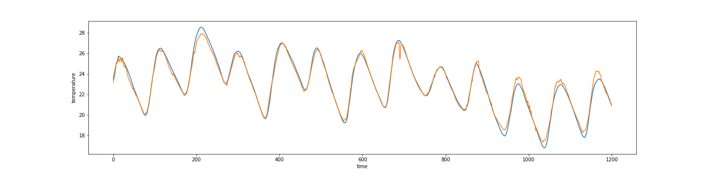

Neural Time Series Analysis
---
## Introduction
There has been a great development in time series forecasting using neural network. We have seen many models from seq2seq to wavenet. 
Yet I struggle to find something simple to use, comprehnsive and flexible for 1D time series regression. So I built one.

This library is a collection of recent models for 1D time-series forecast, either 1 step, multi-step and auto-regressive.

The models are not all mine. Wavenet credits goes to [Sean Vasquez](https://github.com/sjvasquez/) and the Neural Process implementation is inspired by [Kaspar Märtens](https://github.com/kasparmartens/). They did an amazing job, thank you guys!

This repo is still under development and the code is poorely commented, just open an issue or ping me directly.

---
## Features

1. Recurrent models can use the Input Attention mechanism as developed in the DARNN paper, to increate interpretability in case of high-dimensional feature space.
2. Neural Processes in the regression setting, can provide mean and variance for each estimate.
3. Each model can be used in an autoregressive setting

Check nb/ for detailed description.

---
## Datasets
This library comes with the following datasets:
- [SML 2010](https://archive.ics.uci.edu/ml/datasets/SML2010)
- [NASDAQ 100](http://cseweb.ucsd.edu/~yaq007/NASDAQ100_stock_data.html)
- BTC Exchange

Pickle file can be found [here](https://drive.google.com/open?id=0B3B22Hd5PMxSaVpsYmRHU2ZJYWc).

To adapt a new dataset, please check utils.dataset_utils.py.

---
## Models

- Dense
- RNN
- Seq2seq
- [DARNN](https://arxiv.org/pdf/1704.02971.pdf)
- [Neural Process](https://arxiv.org/abs/1807.01622)
- Resnet
- [Wavenet](https://github.com/sjvasquez/web-traffic-forecasting)

---
## Install

```bash
git clone this_repo
pip install -r requirements.txt
```

---
## Usage

```bash
python main.py --model rnn --loss mae --batch_size 12
```

---
## Results on test data




```bash
python main.py --model np --dataset sml
```

check nb/simple_regression.ipynb for more details.
